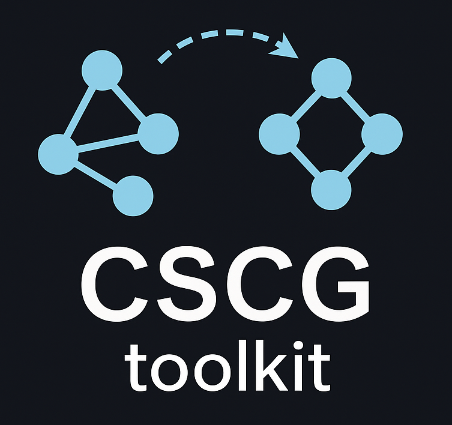

<!--# Clone-Structured Cognitive Graph Toolkit-->

**Action-augmented cloned HMMs for higher-order sequence learning and cognitive map formation**

[](LICENSE)
[](https://julialang.org)
[](https://python.org)

---

## Overview

This repository implements **Clone-Structured Cognitive Graphs (CSCG)**, a probabilistic framework for learning cognitive maps from sequential observations and actions. CSCGs build on **Cloned Hidden Markov Models (CHMM)**, which are sparse HMMs where each hidden state emits a single observation deterministically, with multiple "clones" per observation enabling context-dependent representations based on sequential context. CSCGs extend cloned HMMs by augmenting transitions with actions, enabling spatial/temporal/relational learning and vicarious evaluation (planning without execution) through message-passing inference.

Cognitive maps emerge naturally from latent higher-order sequence learning—organisms learn space by treating it as a sequence.

---

## Repository Structure

```
cscg_toolkit/
├── README.md                    # This file
├── LICENSE                      # MIT License
├── julia/                       # Julia implementation (reference)
│   ├── Project.toml
│   ├── src/                     # Core CSCG library
│   ├── test/                    # Unit & integration tests
│   ├── scripts/                 # Example scripts
│   └── test_data/               # Test fixtures
├── jax/                         # JAX implementation (active development)
│   ├── chmm_jax/                # Core package
│   ├── tests/                   # Test suite
│   ├── examples/                # Usage examples
│   └── README.md                # JAX-specific docs
├── papers/                      # Reference papers and summaries
│   ├── pdf/                     # Original papers (PDFs)
│   ├── md/                      # Markdown conversions
│   └── summaries/               # Deep technical summaries with LaTeX
└── python/                      # Python reference implementation (legacy)
    ├── chmm_actions.py
    ├── intro.ipynb
    └── README.md
```

---

## Core Concepts

### What is a Cloned HMM?

A **Cloned Hidden Markov Model** is a sparse HMM where each hidden state emits a single observation deterministically. Multiple hidden states ("clones") can emit the same observation, enabling context-dependent representations:

```
Observations:  [cell_0, cell_1, cell_2, ...]
                  ↓        ↓        ↓
Hidden States: [s0,s1,s2] [s3,s4,s5] [s6,s7,s8] ...  (3 clones per cell)
```

**Key advantages**:
- **Context-dependent representations**: Same observation splits into different latent states based on sequential context
- **Variable-order dependencies**: Efficiently learns higher-order sequential structure without exponential state explosion
- **Computational efficiency**: Block-structured transitions exploit emission sparsity

### What is CSCG?

**Clone-Structured Cognitive Graphs** extend cloned HMMs by augmenting state transitions with actions. This enables:
- **Spatial/temporal learning**: Cognitive maps emerge from sequential experience with actions
- **Vicarious evaluation**: Message-passing inference enables planning without execution
- **Flexible structure**: Learns graphs from severely aliased observations (same visual input at multiple locations)

### Algorithm Summary

The Baum-Welch algorithm takes a simpler form for cloned HMMs due to emission sparsity:

1. **Forward pass**: α(n+1)ᵀ = α(n)ᵀ T(xₙ, aₙ, xₙ₊₁)
   Computes α(n) = P(x₁:ₙ, a₁:ₙ₋₁, zₙ) using only M×M blocks

2. **Backward pass**: β(n) = T(xₙ, aₙ, xₙ₊₁) β(n+1)
   Computes β(n) = P(xₙ₊₁:N, aₙ:N₋₁ | zₙ) using only M×M blocks

3. **E-step**: ξᵢₖⱼ(n) = [α(n) ∘ T(i,aₙ,j) ∘ β(n+1)ᵀ] / [α(n)ᵀ T(i,aₙ,j) β(n+1)]
   Expected transition counts from clone-set i via action k to clone-set j

4. **M-step**: T(i,k,j) = Σₙ ξᵢₖⱼ(n) / Σₖ′,ⱼ′,ₙ ξᵢₖ′ⱼ′(n)
   Normalize expected counts to probability distributions

**Key insight**: Only compute blocks T(xₙ, aₙ, xₙ₊₁) appearing in observed sequence, yielding O(M²|Σ|²TN_a) complexity instead of O((M|Σ|)²TN_a) for standard HMM.

**Alternatives**:
- **Viterbi training**: Hard assignment (argmax) instead of soft expectations for faster convergence
- **Pseudocount smoothing**: Add κ > 0 to all counts for regularization and preventing zero probabilities
- **Gradient descent** (future): Planned enhancement for end-to-end integration with neural networks

---

## Installation

This repository contains multiple implementations:

- **Julia** (reference): See [julia/README.md](julia/README.md) for installation, usage, and testing
- **JAX** (active development): See [jax/README.md](jax/README.md) for installation and PyTorch integration
- **Python** (legacy): See [python/README.md](python/README.md)

---

## Contributing

This is a research project. Contributions are welcome!

**Priority areas**:
- [ ] Gradient descent training via Flux.jl
- [ ] GPU acceleration
   - [ ] Pytorch 
   - [ ] Jax
- [ ] Performance optimizations
- [ ] Additional test coverage
- [ ] Documentation improvements

**Workflow**:
1. Fork the repository
2. Create a feature branch
3. Add tests for new functionality
4. Ensure all tests pass (`julia --project=julia test/runtests.jl`)
5. Submit a pull request

---

## References

This implementation is based on the following research:

### Foundational Papers

- Dedieu, A., Gothoskar, N., Swingle, S., Lehrach, W., Lázaro-Gredilla, M., & George, D. (2019). Learning higher-order sequential structure with cloned HMMs. *arXiv:1905.00507*
   - Provides theoretical convergence guarantees, demonstrates 10% improvement over LSTMs on language modeling
- George, D., Rikhye, R.V., Gothoskar, N., Guntupalli, J.S., Dedieu, A., & Lázaro-Gredilla, M. (2021). Clone-structured graph representations enable flexible learning and vicarious evaluation of cognitive maps. *Nature Communications, 12*(1), 2392
   - Extends CHMMs with actions, explains hippocampal splitter cells, route encoding, remapping phenomena
- Raju, R.V., Guntupalli, J.S., Zhou, G., Lázaro-Gredilla, M., & George, D. (2022). Space is a latent sequence: Structured sequence learning as a unified theory of representation in the hippocampus. *arXiv:2212.01508* (published *Science Advances*, 2024)
   - Explains dozen+ hippocampal phenomena with single mechanism: latent higher-order sequence learning
- Kansky, K., et al. (2017). Schema networks: Zero-shot transfer with a generative causal model of intuitive physics. *arXiv:1706.04317*
- Lázaro-Gredilla, M., et al. (2018). Beyond imitation: Zero-shot task transfer on robots by learning concepts as cognitive programs. *arXiv:1812.02788* (*Science Robotics*)

### Technical Summaries

Comprehensive paper summaries available in:
- **Synthesis**: [`papers/summaries/README.md`](papers/summaries/README.md) - Cross-paper evolution and unified framework
- **Neuroscience**: [`papers/summaries/00_neuroscience_connections.md`](papers/summaries/00_neuroscience_connections.md) - Hippocampal phenomena explained (place cells, remapping, splitter cells)
- **Individual papers**: [`papers/summaries/`](papers/summaries/) - Deep dive into each paper's methods and results

---

## License

MIT License - see [LICENSE](LICENSE) for details

---

*Last updated: 2025-11-02*
